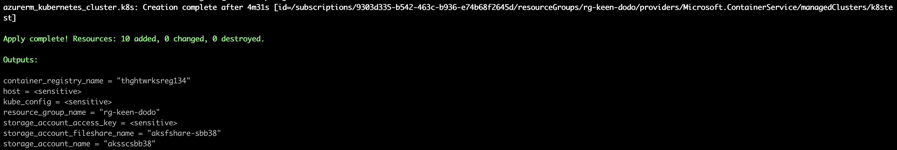
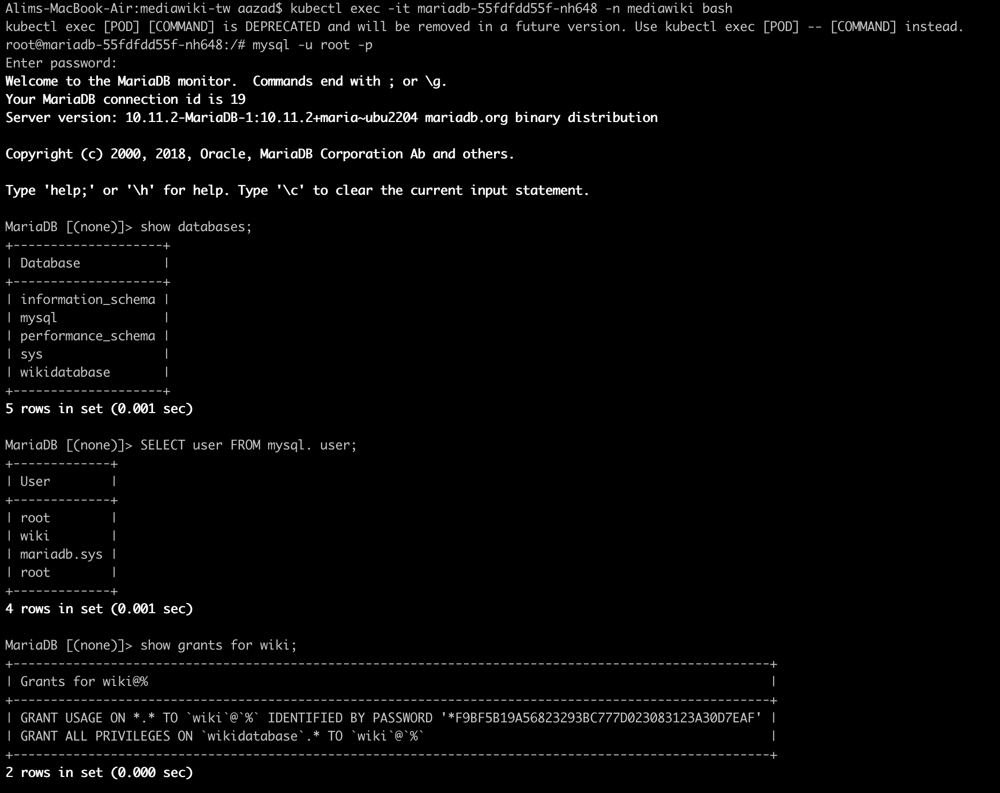

# mediawiki-tw
Deploy Mediawiki 1.39.3 app with MariaDB database

## Pre-Reqisites
---

Below setups need to be available

- Azure Subscription
- Azure CLI
- Terraform CLI 
- Helm 3.7+
- Docker
- kubectl

> NOTE: Kindly ensure you are the owner of the used Azure subscription or the service principal used has owner rights to login, create other service principal or identities. Please login using `az login` command

## MediaWiki compatibility
---
Refer [link](https://www.mediawiki.org/wiki/Compatibility#:~:text=MediaWiki%20is%20broadly%20compatible%20with,a%20good%20choice%20as%20well.) for version compatibility details

As per link, ```MediaWiki support for PHP 8.0 and above started with 1.39.0```, hence we will be using php:8.0-apache as our base image to configure mediawiki 1.39.3.

## Directory Layout
---

Directory structure is divided in 3 folders namely `aks,charts, docker` with one automated shell script i.e. `autodeploy.sh`.


- `aks`: Terraform files to provision aks cluster,container registry,storage account etc under mentioned azure subscription.
- `charts`: Helm chart files for mediawiki application  and maridb database to be deployed on above provisioned AKS cluster.
- `docker`: Dockerfile to create mediawiki and mariadb images.
- `autodeploy.sh`: Script to run automated provisioning of services on Azure and deployment of generated helm charts on AKS.

---
## Script Syntax:
---

```
bash -x autodeploy.sh ${subscription_id}
```

---
## Steps 
---

We will divide this into two sections .
1. Shell Script Execution
2. UI Steps

Lets Begin

---
### Shell Script Execution
---

- Checkout github [repo](https://github.com/alim10081989/mediawiki-tw.git)
- Execute script [autodeploy.sh](autodeploy.sh) with the azure subscription id provided . e.g.

```
./autodeploy.sh 9303d335-xxxx-xxxx-xxxx-xxxxxx
```

- Firstly, terraform execution runs to provision below mentioned resources with screenshots of terraform run and portal display.

    - Create service principal named `thghtwrksuser`
    - Resource Group with Unique Name
    - Azure Kubernetes Service Cluster named `k8stest`
    - Log Analytics workspace with Container Insights Solution.
    - Storage Account with Unique Name
    - Azure Container registry named `thghtwrksreg134` 

Screenshot 1:



Screenshot 2:


- In second step, kubernetes steps are done where the config file for the provisioned AKS cluster is set with environment variable `KUBECONFIG` and namespace `mediawiki` with secret named `mariadb` created within the namespace . Change the root and user password as per requirement.

Below code block under `k8s_ops` function creates the secret named `mariadb`. Update the password details as per requirement. Updating the secret to other names except for the mentioned i.e. `mariadb` will require changes within helm chart values file [mariadb/values.yaml](./charts/mariadb/values.yaml)

```
kubectl create secret generic mariadb --from-literal=root_pass=secret --from-literal=wiki_user_pass=wiki_pass123 -n mediawiki
```

Screenshot 1:


Screenshot 2:


Screenshot 3:


- In third step, the `Dockerfile` under directory [docker](./docker/) for `mediawiki` and `mariadb` are built under Azure Container Registry(ACR) Task feature. This feature basically uploads the required dockerfile with its context on Azure and builds the image and pushes to ACR repository.

Screenshot 1:


Screenshot 2:


Screenshot 3:


Screenshot 4:


Screenshot 5:


- In fourth steps, ingress controller named `ingress-nginx` is installed via helm chart on the AKS cluster to provide the capabilities of using Ingress service that will serve as reverse proxy to our configured services in the last step. All the required images are also uploaded within this step to the ACR repository named `thghtwrksreg134`.

Screenshot 1:


Screenshot 2:


>NOTE: The helm charts seen in screenshot 2 will be uploaded in the next section.

- As final step, helm charts for `mediawiki` and `mariadb` respectively will be created and pushed to the ACR named `thghtwrksreg134`. It will use the created service principal created in the terraform step to authenticate. Post pushing the packaged helm chart deployment will be done to the provisioned AKS cluster.

Screenshot 1:


>NOTE: Kindly note down the URL provided as it will be used in the UI steps 


- Kindly verify the user `wiki` is created within `wikidatabase` under MariaDB pod. Use the root password as defined within script in second step.

Screenshot 1:



Screenshot 2:


---
## MediaWiki WebPage UI Steps
---

- Hit the url provided to access the `mediawiki`

```
http://${ingress_ip}/mediawiki/
```

Screenshot:


- Click on `set up the wiki` -> `Continue` and set the backend with MariaDB database configured within the AKS cluster. Below details need to be provided .

    - Database Host i.e. `mariadb`
    - Database Name i.e. `wikidatabase`
    - User account for Installation `wiki`
    - User password i.e. `wiki_pass123`

>NOTE: This are the values currently provided as an example. Update the secret creation command in shell script with the required password for user and root. Update the `non-root` username under helm charts located at [mariadb/values.yaml](./charts/mariadb/values.yaml) 


MariaDB Setup


- Configure the `mediawiki` title name and `Administrator` account with `username` &  `password` and click `I am bored already,continue with Install`.


- A status page with the installation status would be displayed as below .


- Click `Continue` and it should display below page with complete status for `mediawiki` installation and a file named `LocalSettings.php` would be downloaded. 


>NOTE: Please do not close the page. Keep it open and perform step in the backend.

- Copy the `LocalSettings.php` to the directory under `mediawiki` pod running on K8s cluster. This is one of the manual step to be done.


- Once done with above step, go to the webpage and click `enter your wiki`.


---
## Additional Info
---

The credentials for the generated service principal would be available under file named `sp_thghtwrks.json` under the [aks](./aks/) folder. If required you can refer the file for verifying the credentials . 

> INFO: `sp_thghtwrks.json` file is dynamically generated so it won't be available in the repository

Thats it folks . Go ahead and explore MediaWiki. 

---
## Contributors
---

Alim Azad